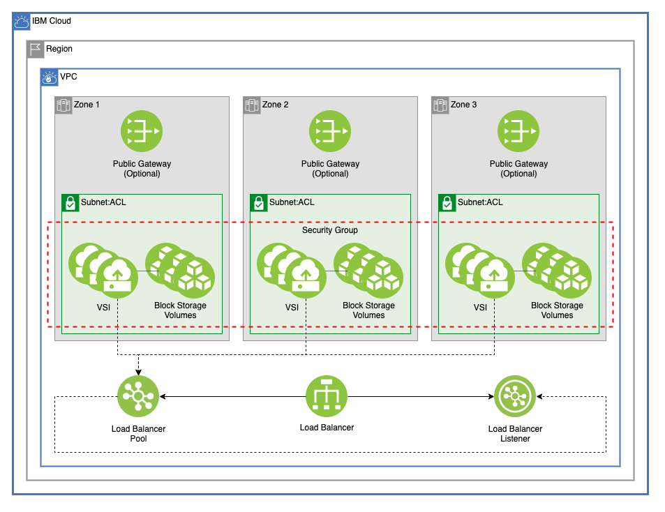

# Architecture Multizone VPC With VSI and Load Balancer

This architecture creates a Multizone VPC with one subnet in each zone, VSI with block storage volumes attached across the subnets, and a load balancer connecting the VSI instances. For this example, NGINX is installed on the Virtual Servers to show connectivity.

---

## Table of Contents

1. [VPC](##VPC)
2. [Virtual Servers](##Virtual-servers)
3. [Outputs](##Outputs) (optional)
4. [As a Module in a Larger Architecture](##As-a-Module-in-a-Larger-Architecture)

---

## VPC

This template uses the [Multizone VPC Module](./multizone_vpc) to create a VPC, three subnets with one in each zone of a region, and an ACL for those three subnets. Optionally, a public gateway can be provisioned in each zone and attached to the subnets

---

## Virtual Servers

This template uses the [VSI Workspace Module](./vsi_workspace) to create any number of identical VSIs on each of the three subnets. These VSI are connected by a single security group. The rules for this security group are to allow all inbound an outbound traffic. The security group rules can be edited in [/vsi_workspace/network.tf](./vsi_workspace/network.tf).

---

## Module Variables

Variable              | Type   | Description                                                                                                                                                                                           | Default
--------------------- | ------ | ----------------------------------------------------------------------------------------------------------------------------------------------------------------------------------------------------- | -------
ibmcloud_api_key      | string | The IBM Cloud platform API key needed to deploy IAM enabled resources                                                                                                                                 | 
unique_id             | string | A unique identifier need to provision resources. Must begin with a letter                                                                                                                             | `"asset-mz-vpc"`
ibm_region            | string | IBM Cloud region where all resources will be deployed                                                                                                                                                 | 
resource_group        | string | Name of resource group to create VPC                                                                                                                                                                  | `"asset-development"`
generation            | number | generation for VPC. Can be 1 or 2                                                                                                                                                                     | `2`
enable_public_gateway | bool   | Enable public gateways for subnets, true or false                                                                                                                                                     | `true`
acl_rules             |        | Access control list rule set                                                                                                                                                                          | [ { name = "egress" action = "allow" source = "0.0.0.0/0" destination = "0.0.0.0/0" direction = "inbound" }, { name = "ingress" action = "allow" source = "0.0.0.0/0" destination = "0.0.0.0/0" direction = "outbound" } ]
ssh_public_key        | string | ssh public key to use for vsi                                                                                                                                                                         | 
image                 | string | Image name used for VSI. Run 'ibmcloud is images' to find available images in a region                                                                                                                | `"ibm-centos-7-6-minimal-amd64-2"`
machine_type          | string | VSI machine type. Run 'ibmcloud is instance-profiles' to get a list of regional profiles                                                                                                              | `"bx2-8x32"`
vsi_per_subnet        | number | Number of VSI instances for each subnet                                                                                                                                                               | `1`
enable_fip            | bool   | Enable floating IP. Can be true or false                                                                                                                                                              | `true`
security_group_rules  |        | List of security group rules to be added to default security group                                                                                                                                    | { allow_all_outbound = { source = "0.0.0.0/0" direction = "outbound" }, allow_all_inbound = { source = "0.0.0.0/0" direction = "inbound" } }
volumes               | list(o | A list of maps describng the volumes for each of the VSI /*                                                                                                                                           | [ { name = "one" profile = "10iops-tier" capacity = 25 }, { name = "two" profile = "10iops-tier" }, { name = "three" profile = "10iops-tier" } ]
type                  | string | Load Balancer type, can be public or private                                                                                                                                                          | `"public"`
listener_port         | number | Listener port                                                                                                                                                                                         | `80`
listener_protocol     | string | The listener protocol. Supported values are http, tcp, and https                                                                                                                                      | `"http"`
certificate_instance  | string | Optional, the CRN of a certificate instance to use with the load balancer. To not use a certificate instance, leave string empty                                                                      | `""`
connection_limit      | number | Optional, connection limit for the listener. Valid range 1 to 15000. To not enforce connection limit, leave as 0.                                                                                     | `0`
algorithm             | string | The load balancing algorithm. Supported values are round_robin, or least_connections. This module can be modified to use weighted_round_robin by adding `weight` to the load balancer pool members.   | `"round_robin"`
protocol              | string | The pool protocol. Supported values are http, and tcp.                                                                                                                                                | `"http"`
health_delay          | number | The health check interval in seconds. Interval must be greater than timeout value.                                                                                                                    | `11`
health_retries        | number | The health check max retries.                                                                                                                                                                         | `10`
health_timeout        | number | The health check timeout in seconds.                                                                                                                                                                  | `10`
health_type           | string | The pool protocol. Supported values are http, and tcp.                                                                                                                                                | `"http"`
pool_member_port      |        | The port number of the application running in the server member.                                                                                                                                      | `80`