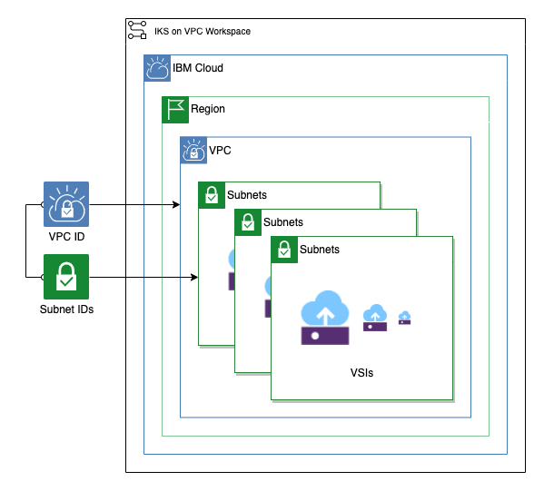

# VSI Workspace

This module creates any number of VSIs in subnets attached to a provided VPC.

## Table of Contents

1. [SSH Key](##ssh-key)
2. [VSI](##vsi)
3. [Floating IP](##floating-ip)
4. [Module Variables](##Module-Variables)
5. [Outputs](##Outputs)

---

## SSH Key

This module creates an ssh key for VPC using the `ssh_public_key` variable. To use an existing SSH Key, change this block and it's references to a `data` block.

---

## VSI

Creates any number of identical VSI with any number of volumes using the ssh key and volumes. By default, these VSI will have nginx installed using the bash scripts found in [./config](./config)

---

## Module Variables

| Variable           | Type   | Description                                                                              | Default                          |
| ------------------ | ------ | ---------------------------------------------------------------------------------------- | ---------------------------------|
| `ibmcloud_api_key` | sting  | The IBM Cloud platform API key needed to deploy IAM enabled resources                    |                                  |
| `vpc_name`         | string | Name of VPC                                                                              |                                  |
| `ibm_region`       | string | IBM Cloud region where all resources will be deployed                                    |                                  |
| `resource_group`   | string | Name of resource group to create VPC                                                     | `asset-development`              |
| `unique_id`        | string | A unique prefix for the apps. Must begin with a letter.                                  | `asset-module-vsi`               |
| `generation`       | number | Generation for VPC                                                                       | 2                                |
| `subnet_names`     | number | A list of subnet names where VSI will be deployed                                        | `[]`                             |
| `enable_fip`       | bool   | Enable floating IP. Cab be true or false                                                 | `true`                           |
| `image`            | string | Image name used for VSI. Run 'ibmcloud is images' to find available images in a region   | `ibm-centos-7-6-minimal-amd64-2` |
| `ssh_public_key`   | string | SSH public key to use for vsi                                                            |                                  |
| `machine_type`     | string | VSI machine type. Run 'ibmcloud is instance-profiles' to get a list of regional profiles | `bx2-2x8`                        |
| `vsi_per_subnet`   | number | Number of VSI instances for each subnet                                                  | 1                                |

---

## Outputs

| Name              | Value                                    |
| ----------------- | ---------------------------------------- |
| `vsi`             | Provisioned VSIs IDs, subnets and zones. Each VSI is an object that has the VSI ID, the zone, and the primary ipv4 address |
